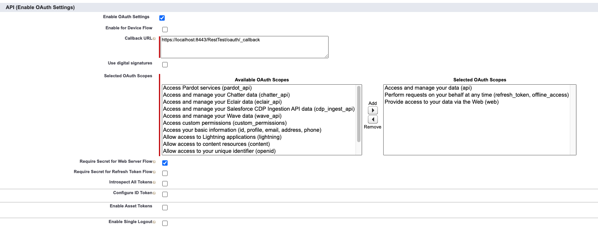

# Example Projects

Since these are standalone projects distinct from the `token-manager-for-salesforce project`, you must help IntelliJ recognize them. Right-click on the `settings.gradle` file within each project and select the "Import Gradle Project" option.

These small sample projects each expose a single Rest endpoint `GET /salesforce/query?q={SOQL QUERY HERE}`. This endpoint takes in a SOQL query as the query parameter and executes this query against the configured Salesforce instance. It uses the `token-manager-for-salesforce` library to handle authenticating with the Salesforce instance to execute the request. It calls the Salesforce [SOQL Query API](https://developer.salesforce.com/docs/atlas.en-us.api_rest.meta/api_rest/dome_query.htm) and simply passes through the response.

Note that in `settings.gradle` we use [Gradle Composite Builds](https://docs.gradle.org/current/userguide/composite_builds.html) to point to the local version of this library. This way you can use this project to easily test changes to the library. If you'd prefer to point to a deployed version, simple remove the `includeBuild '../../../token-manager-for-salesforce'` line from `settings.gradle`.

### How to Run

To run the application you will need to pass in environment variables with credentials for your Salesforce environment. In [application.yml](webflux-example/src/main/resources/application.yml) you can find the required secrets.

You can use IntelliJ's run configurations to set environment variables or run the application directly from the commandline using Gradle. Ensure you are in the example project's directory and execute, substituting in your real secrets.

```shell
./gradlew bootRun --args='--salesforce.host=secret_host --salesforce.username=secret_username --salesforce.password=secret_password --salesforce.client-id=secret_id --salesforce.client-secret=secret_secret'
```

Examples of what these values may look like for your org:

```
SF_HOST: https://your_org--sandbox_name.my.salesforce.com
SF_USERNAME: some_username@your_org.com.service.sandbox_name
SF_PASSWORD: password for the above account
SF_CLIENT_ID: long string of numbers and letters
SF_CLIENT_SECRET: long string of numbers and letters
```

If you already have a connected app set up, you can find the client ID and client secret in Setup > App Manager > Right click, View on your connected app.

If you do not have a connected app, you can follow instructions [here](https://help.salesforce.com/articleView?id=sf.connected_app_create_api_integration.htm&type=5) to create a new one. Fill out the basic Connected App information and use the following for the oAuth settings to get started. You may want to customize these later to limit access. After you create the connected app, a client ID and secret will be generated.



### How to Test

Once you have the application running, you should be able to execute the following cURL to hit the Rest endpoint:

```shell
curl --request GET \
  --url 'http://localhost:8080/salesforce/query?q=SELECT%20ID%2C%20Name%20FROM%20ACCOUNT%20LIMIT%201'
```

Note that the SOQL query is URL encoded. The query being executed is: `SELECT ID, Name FROM ACCOUNT LIMIT 1`. You should get a response with something like:

```json
{
  "totalSize": 1,
  "done": true,
  "records": [
    {
      "attributes": {
        "type": "Account",
        "url": "/services/data/v51.0/sobjects/Account/001P000001opKSMIA2"
      },
      "Id": "001P000001opKSMIA2",
      "Name": "Francis Johnson"
    }
  ]
}
```
